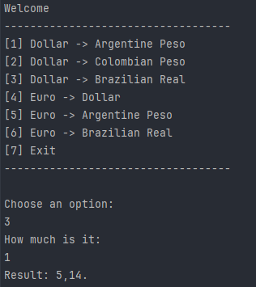

# Conversor de Moedas

<div align="center">
  
  [](https://opensource.org/licenses/MIT)
  [](https://www.java.com/)
  []()
  []()

</div>

## Sobre
Esté é um simples projeto que permite a conversão de valores entre algumas moedas, o objetivo principal é como implementar APIs externas dentro da nossa. O programa usa a API de taxas de câmbio para obter as taxas de conversão em tempo real.

<div>
    
</div>

## Funcionalidades

- Escolha a moeda de destino para conversão;
- Insira o valor em Real brasileiro que deseja converter;
- Veja o valor convertido na moeda de destino.

## Como usar


<h4>1. Clonagem</h4>

```bash
git clone https://github.com/marllonmendez/currencyConversion.git
```

<h4>2. Execute no terminal</h4>

```bash
java -cp .\Dependencies\gson-2.10.1.jar .\src\Main.java
```

## Badge
Este é um badge conquistado por ter desenvolvido este projeto com a Alura em parceria da Oracle para o programa One **"Oracle Next Education"**

<div align="center">
  
</div>

## Licença

Este projeto está licenciado sob a [Licença MIT](LICENSE).
