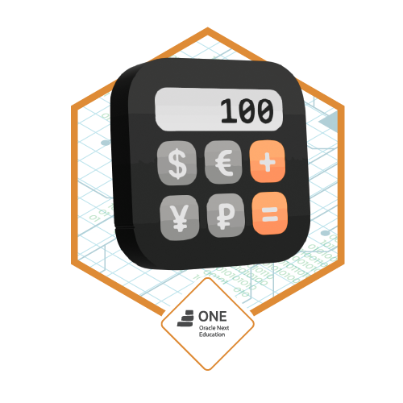

# Conversor de Moedas

  
  
  
  
  

 

## Sobre
Esté é um simples projeto que permite a conversão de valores entre algumas moedas, o objetivo principal é como implementar APIs externas dentro da nossa. O programa usa a API de taxas de câmbio para obter as taxas de conversão em tempo real.

## Funcionalidades

- Escolha a moeda de destino para conversão;
- Insira o valor em Real brasileiro que deseja converter;
- Veja o valor convertido na moeda de destino.

## Badge
Este é um badge conquistado por ter desenvolvido este projeto com a Alura em parceria da Oracle para o programa One **"Oracle Next Education"**

## Licença

Este projeto está licenciado sob a [Licença MIT](LICENSE).
